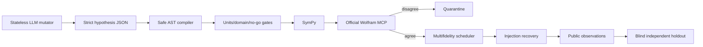

# Multiverse Lab

Constraint-first open research infrastructure for **falsifiable multiverse-adjacent physics**.

This repository does not assume that a multiverse exists. It turns speculative hypotheses into restricted machine-readable candidates, rejects them with cheap deterministic checks, and permits observational language only after calibrated, blinded, independently replicated evidence.

## Current result

| Question | Current evidence |
|---|---|
| Does the controlled spherical filter recover injected bubbles? | 5/5 signal-only; 4/5 with supplied CMB+noise under frozen diagnostic threshold |
| Does WMAP show a globally unusual bubble-template excess in this pilot? | No: observed max `4.9368σ`, 99% null threshold `5.3987σ`, diagnostic empirical `p=0.1318` from 128 global nulls |
| Does this prove or disprove a multiverse? | No. It tests one bubble-collision template family only |
| Is a portal gun feasible? | Not assessable: target existence, causal accessibility, and operational targeting are not established |

Canonical outputs: [`results/fixture-reproduction.json`](results/fixture-reproduction.json), [`results/wmap-pilot.json`](results/wmap-pilot.json), and [`research/evidence-ledger.csv`](research/evidence-ledger.csv).

## What is already implemented



- Restricted scientific hypothesis IR; no `eval`, `exec`, `parse_expr`, or generated-code execution.
- Exact dimension and conservative domain screening.
- Independent SymPy/Wolfram status with CAS disagreement quarantine.
- Append-only, hash-chained hypothesis event archive.
- Budgeted expected-information scheduler with one remote LLM request maximum.
- HEALPix/ducc0 CMB bubble-template fixture and WMAP/KQ75 diagnostic.
- Evidence, claims, trials, provenance, approval, and holdout contracts.

## Reproduce

Requirements: Python 3.11–3.13, [`uv`](https://docs.astral.sh/uv/), Git, and optionally [Bun](https://bun.sh/) for verified data acquisition.

```bash
git clone https://github.com/DKeken/multiverse-lab.git
cd multiverse-lab
uv sync --frozen
bun scripts/fetch-data.ts --group fixture
uv run python src/cmb_fixture_repro.py --output results/fixture-reproduction.json
```

WMAP diagnostic downloads approximately 48 MiB and opens development data only:

```bash
bun scripts/fetch-data.ts --group wmap
uv run python src/wmap_pilot.py --null-simulations 128 --output results/wmap-pilot.json
```

The synthetic masked T/Q/U gate uses optional native NaMaster and PySM3 engines. On macOS with Homebrew, install `cfitsio`, `fftw`, `gsl`, `libomp`, `autoconf`, `automake`, and `libtool`, then:

```bash
uv sync --frozen --extra masked-te
uv run --extra masked-te python src/masked_te_injection.py
```

This command uses synthetic CMB and PySM foregrounds only. It does not fetch or open Planck or observational polarization maps.

Planck is a declared holdout and is **not** fetched automatically. See [`research/planck-confirmation.yml`](research/planck-confirmation.yml).

## Research tracks

1. Inflationary bubble collisions in CMB temperature and polarization.
2. Cosmic topology through matched circles and harmonic covariance.
3. Stochastic gravitational-wave backgrounds with model/rival discrimination.
4. Objective-collapse deviations from standard quantum mechanics.
5. Analogue-gravity experiments, explicitly separated from spacetime claims.
6. Traversable-wormhole consistency checks only after destination evidence gates.

Detailed observables, ready datasets, reusable software, missing inventions, cheapest gates, and forbidden conclusions: [`docs/RESEARCH_ROADMAP.md`](docs/RESEARCH_ROADMAP.md).

## Contribute

High-value contributions are falsifiers, null simulations, independent reproductions, foreground/systematics vetoes, calibrated templates, and dataset adapters—not unsupported extraordinary claims.

- Start with [`CONTRIBUTING.md`](CONTRIBUTING.md).
- Use structured GitHub issue forms.
- Every claim needs epistemic class, source, rival explanation, falsifier, trial accounting, and reproducible artifact.
- Never upload restricted, private, or large upstream data. Add it to [`data/registry.json`](data/registry.json) with license and hash.

## Scientific boundaries

- LLM output is mutation material, never evidence.
- CAS verifies mathematics, not physical reality.
- Simulation is not observation; analogue is not gravitational spacetime.
- No discovery language without frozen analysis, global calibration, independent instrument holdout, and replication.
- No result here establishes an accessible universe, causal channel, destination address, or portal technology.

## License and citation

Code and repository-authored documentation: GPL-3.0-or-later. Upstream datasets and software retain their own licenses; see [`NOTICE`](NOTICE) and [`data/registry.json`](data/registry.json).

Citation metadata: [`CITATION.cff`](CITATION.cff).
